# Implementation of Nested Sampling on Light House Problem
By Ammar Zahin, Ioannis Michaloliakos, Nimesh Pokhrel, and Sanjib Katuwal

## Light house Problem Statement
#### 2D Problem
A lighthouse is somewhere off a piece of straight coastline at a position α along the shore and a distance β out at sea. It emits a series of short highly collimated flashes at random intervals and hence at random azimuths. These pulses are intercepted on the coast by photo-detectors that record only the fact that a flash has occurred, but not the angle from which it came. N flashes have so far been recorded at positions {xk}. Where is the lighthouse?’
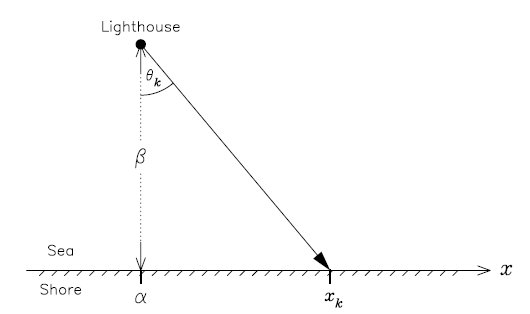

#### 3D Problem
An analogous problem in 3D so that the lighthouse is now at a position (α, β, γ) and the flashes are emitted at random azimuths and polar angles. The photo-detectors are now located at positions {xk, yk}. Where is the lighthouse?’

## Bayesian Inference
Bayesian inference derives the posterior porbablity from two antecendents: a prior probability and a likelihood function. The posterior probability is the probability of a hypothesis given the data. The prior probability is the probability of a hypothesis before the data is observed. The likelihood function is the probability of the data given the hypothesis. The posterior probability is calculated using Bayes’ theorem:
$$P(H|E)=\frac{P(E|H)\cdot P(H)}{P(E)}$$
where, the LHS is the posterior probability, on RHS $P(E|H)$ is the likelihood function, $P(H)$ is the prior probability, and $P(E)$ is the evidence.
### Likelihood Function
#### 2D Case:
The lighthouse emits light in random directions,
$$ L(\theta)d\theta = \frac{1}{\pi}d\theta$$
In cartesian coordinates, the likelihood function is,
$$ L(\textbf{r})dr=\frac{1}{\pi}\frac{z_{LH}}{(x-x_{LH}^2)^2+z_{LH}^2}$$
where, subscript LH denotes the Light House.
#### 3D Case:
The lighthouse emits light in random directions,
$$L(\theta,\phi)d\theta d\phi=\frac{1}{\pi^2}d\theta d\phi$$
In cartesian coordinates, the likelihood function is,
$$L(\textbf{r})dr=\frac{1}{\pi^2}\frac{z_{LH}}{(x-x_{LH}^2)^2+(y-y_{LH}^2)^2+z_{LH}^2}\frac{1}{\sqrt{(x-x_{LH}^2)^2+(y-y_{LH}^2)^2}}$$
where, subscript LH denotes the Light House.

### Multiple Light Houses
The likelihoods for multiple lighthouses add up with weighted ratios equal to their relative brightness.
$$L(\textbf{r}_1,\textbf{r}_2)=I_1L(\textbf{r}_1)+I_2L(\textbf{r}_2)$$
where, $I_1$ and $I_2$ are the relative brightness of the two lighthouses and $I_1+I_2=1$.

## Nested Sampling
Nested Sampling is a computational method for Bayesian inference. It is a Monte Carlo method developed by physicist John Skilling in 2004. We note that the evidence is an integral over likelihood and prior:
$$P(E)=\int P(E|H)P(H)dH$$
or, as an example,
$$Z=\int L(\theta)\pi(\theta)d\theta$$
Usually, the integral is in a high-dimensional space but only a small region actually contributes to it. One usual approach is to use Markov Chain Monte Carlo with Metropolis-Hashtings. However, this approach focusses in on peak of the posterior and explores in that vicinity. This is good enough for parameter estimation but not when we need to calculate evidence as well, which is usually needed for model selection. Nested Sampling is a method that explores the entire posterior space and calculates the evidence. It is a Monte Carlo method that uses a set of nested samples to approximate the evidence. The method is based on the idea that the evidence is the sum of the likelihoods of the samples. It is described in the following steps:
1. Makes a ordering set of likelihood points.
2. Introduces prior volume: fraction of prior contained within an iso-likelihood contour.
$$X(\mathcal{L})=\int_{\mathcal{L}(\theta)>\mathcal{L}}\pi(\theta)d\theta$$
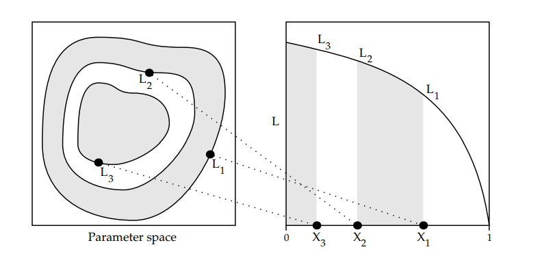

3. Used to transform the evidence calculation from multidimensional integral to a one dimensional integral.
   $$Z=\int\mathcal{L}(\theta)d\theta\longrightarrow Z=\int_0^1\mathcal{L}(X)dX$$
4. Points chosen randomly from the region $\mathcal{L}(X)$ are representative of posterior.
5. Sample uniformly from prior maintaining a popilation of live points that is updated so that they contract around the peak of the posterior, as shown in the figure below.
   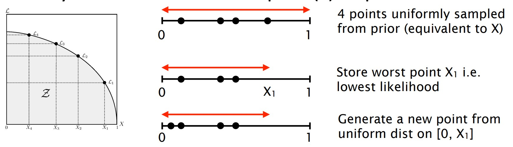
6. In practice, the likelihood-sorting is not even necessary. We could bypass the use of X by obtaining $\theta_i$ directly by sampling from within the equivalent constraint $L(\theta)>L_{i-1}$, in proportion to the prior density $\pi(\theta)$. Such points within the constraint can be found using MCMC. This is the method used in the implementation.

### Nested Sampling Algorithm
1. Initialize the population of live points with $N$ points uniformly distributed in the prior volume. 
2. Repeat for i=1, 2, ... j;
   
   1. record the lowest of the current likelihood values as $L_i$.
   2. set $X_i = exp(-i/N)$.
   3. set $w_i = X_{i-1} - X_{i}$.
   4. increment Z by $w_iL_i$.
   5. replace point of lowest likelihood by new one drawn from within $L(\theta)>L_{i-1}$, in proportion to the prior density $\pi(\theta)$.
3. Increment Z by $N^{-1}(L(\theta_1)+\cdots+L(\theta_N))X_j$.

## Code Architecture
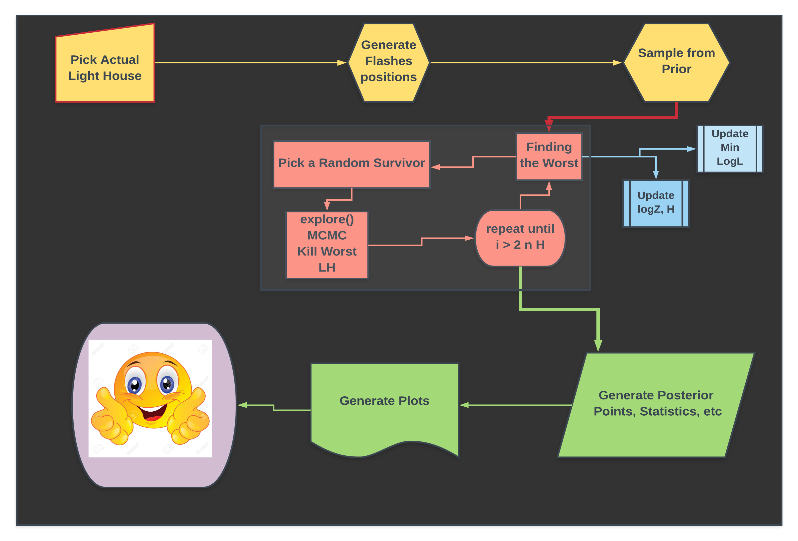

## Tests
### Uncertainty in Z vs the number of flashes
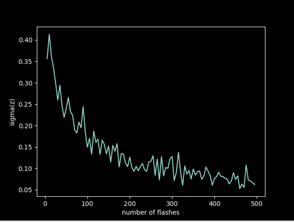
### Uncertainty in Z vs Z
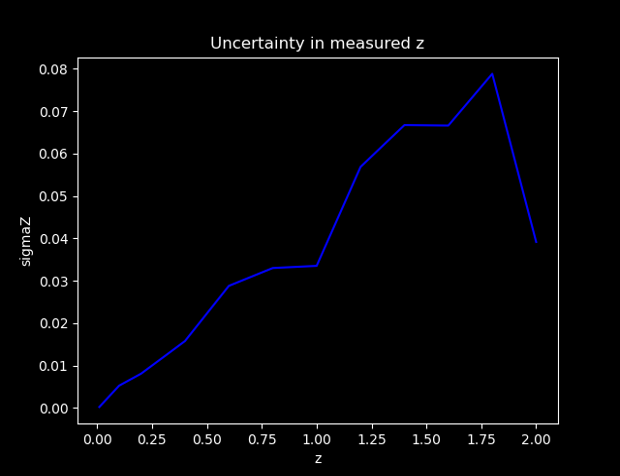
### Number of iteration as a function of live points
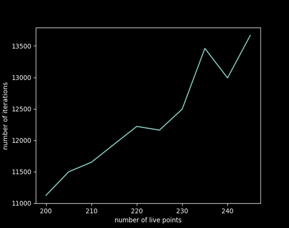
### Relative error in log(Z) vs the live points
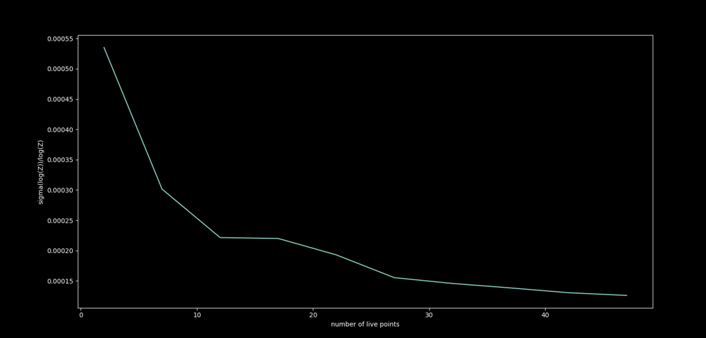

## Results
### 2D Problem
#### One Light House
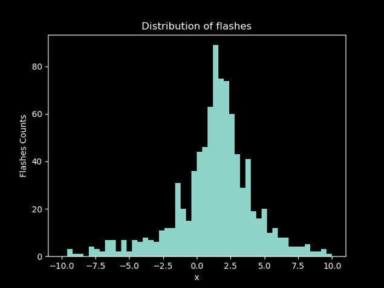
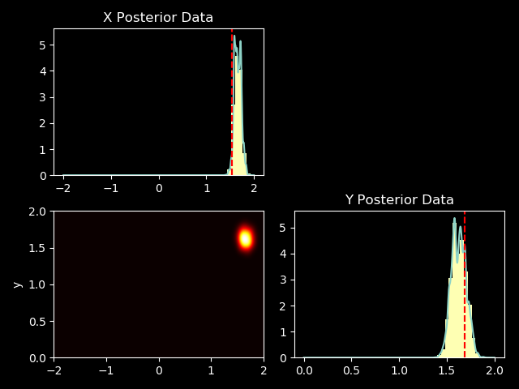

#### Three Light House
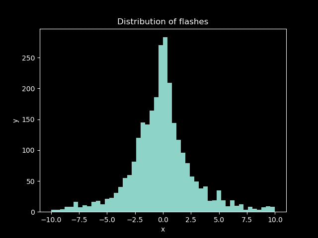
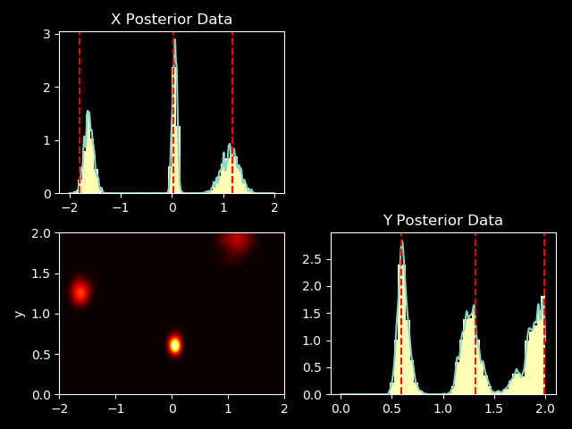

### 3D Problem
#### One Light House
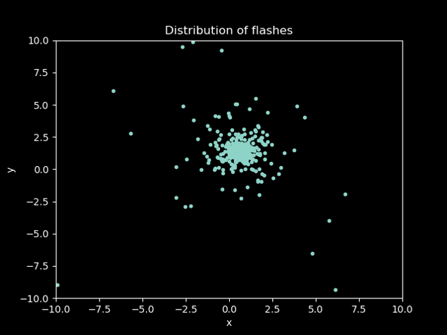
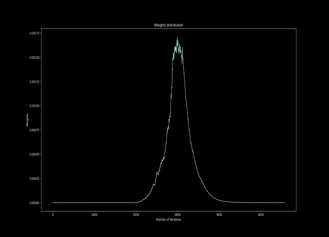
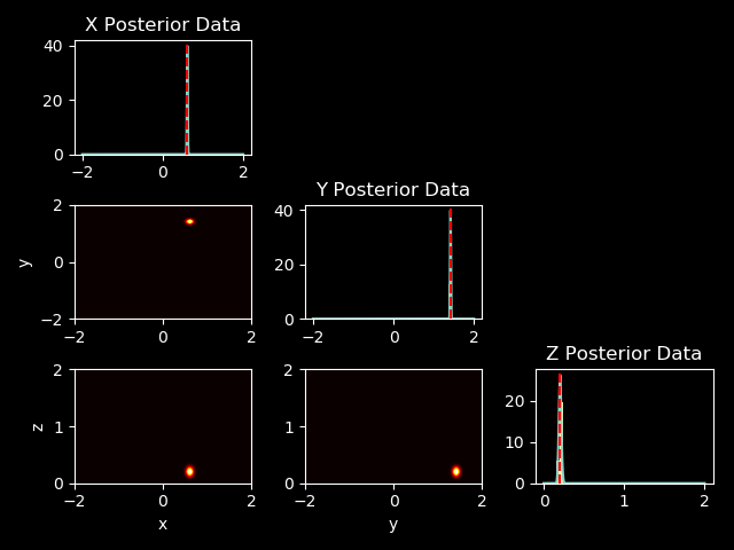
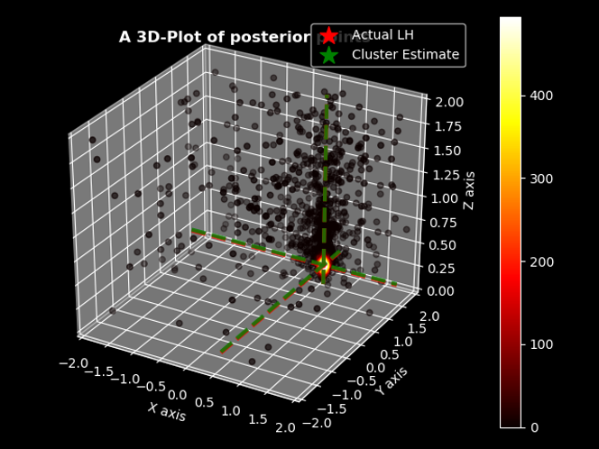

#### Two Light House
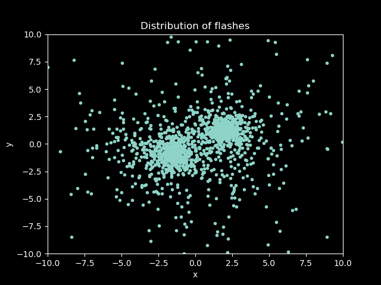
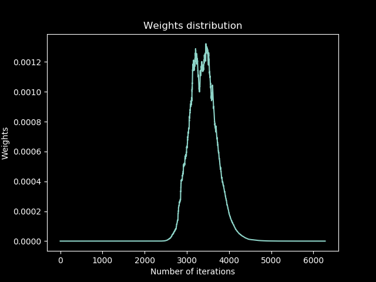
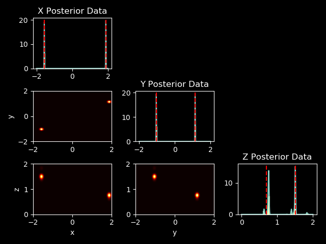
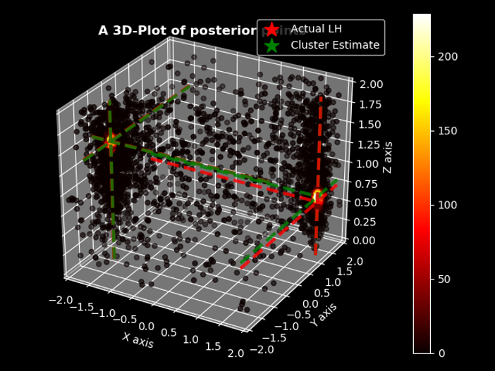

## References
1. [Nested Sampling by John Skilling](https://projecteuclid.org/journals/bayesian-analysis/volume-1/issue-4/Nested-sampling-for-general-Bayesian-computation/10.1214/06-BA127.full)
2. [Light House Problem](http://www.di.fc.ul.pt/~jpn/r/bugs/lighthouse.html)
3. [Sivia Data Analysis with Skilling](https://www.amazon.com/dp/0198568320)
4. [Nested Sampling by Jonathan Pritchard](https://www.imperial.ac.uk/media/imperial-college/research-centres-and-groups/astrophysics/public/icic/data-analysis-workshop/2016/NestedSampling_JRP.pdf)
5. [Wikipedia](https://en.wikipedia.org/wiki/Nested_sampling)